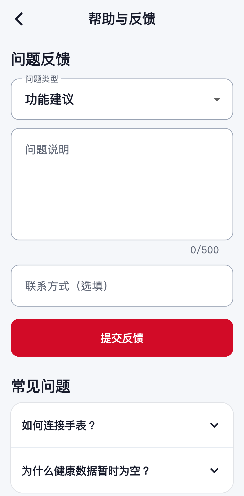
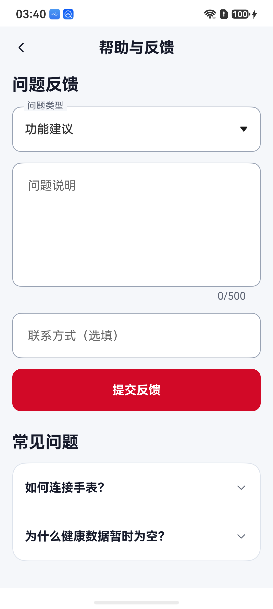
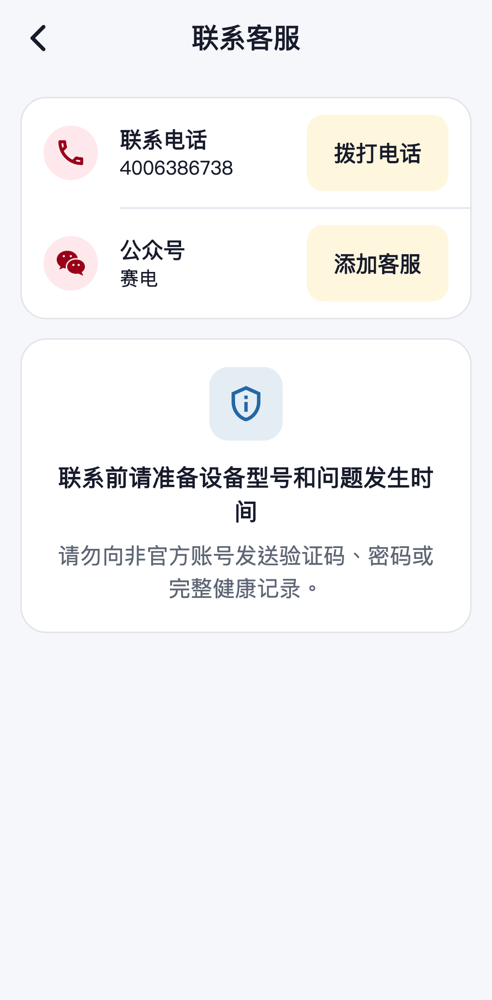
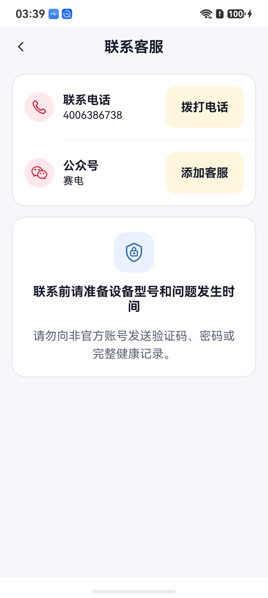
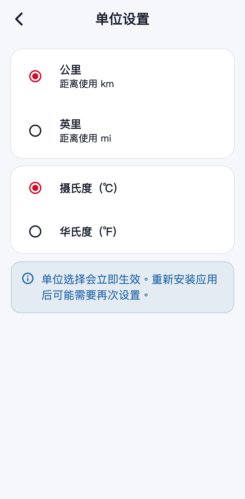
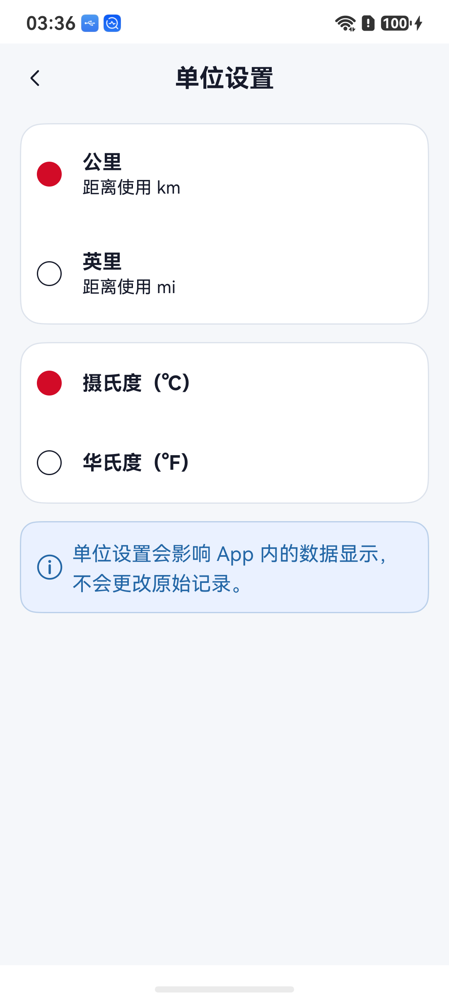
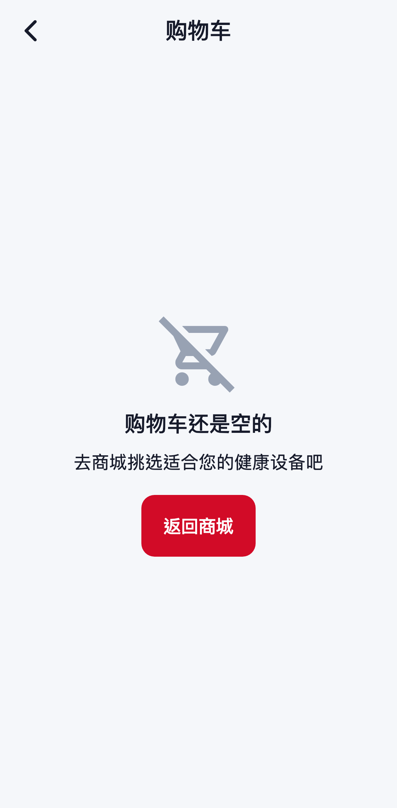
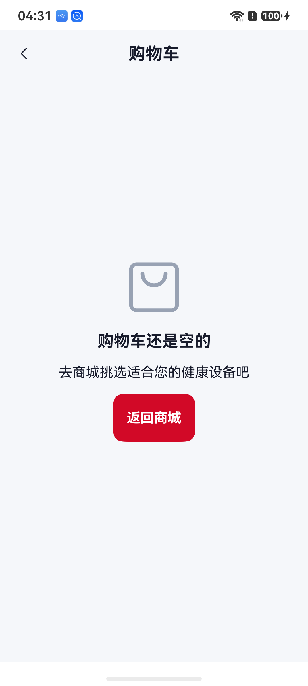

# SayDian 赛电鸿蒙版 iOS 对齐设计 QA

## 当前结论（2026-09-06 内页复查）

**部分页面整改已验证，不是全 App 一致性或正式上线通过。** 下方原记录为前一轮首页/基础内页历史，不能继续用其中“P1/P2 无”概括全部内页。

- 本轮直接追踪 iOS 当前实际路由，并将参考从 27 页扩展为 33 个产品页面的离线渲染；合成数据仅用于参考工具，非 iPhone 真机截图。
- 当前 iPhone UI 自动化受到物理密码确认限制；不使用旧模拟器截图代替当前版本，不绕过设备保护。
- 参考内容区为 361.33 × 733 逻辑尺寸；鸿蒙 nova 14 截图 1084 × 2412，顶部/底部另有原生系统栏。比对时区分系统栏与 App 内容，不将整图高度差误认为排版差。
- 按图像对照流程，参考图和鸿蒙截图置于同一比较输入，检查字号、卡片/边框、间距、图标、按钮、空态和数据状态；原 Logo 与素材保持只读。

### 本轮逐页矩阵

| 页面 | 本轮检查/修改 | 未完成或未实测 |
| --- | --- | --- |
| 账号、资料、重置密码 | 分组入口、字段、生日、保存状态/错误、返回 | 头像上传和注销入口仍待补；没有真机改密码或资料 |
| 收货地址、新增/编辑 | 修正参考到当前 ShopAddressBookPage；真实列表、双入口、地区联动、默认开关、空表单与取消 | 服务端地址写入仅合成传输测试，不向真实账号写入测试地址 |
| 单位、帮助反馈、联系 | 与源页面同组结构、真实选择/复制/拨号、字数与 FAQ；遮线标签已修正 | Radio/下拉/电话/权限采用鸿蒙原生形式；没有真实反馈或客服通话 |
| 关于、权限 | 真实版本、法律入口、当前权限状态、简明健康说明 | 版本值必须是鸿蒙自身版本，不能照抄 iOS；不虚构未声明权限 |
| 关爱、邀请、共享、共享设置 | 概要、按钮排列、实际成员、分组开关和服务端权限保持 | 成员/授权截图只留本机；未变更真实授权或回应邀请 |
| 成员数据/单项记录 | 日期、字段、空态与读取失败分离，真实波形仅在有采样时显示 | 所选成员两日均无可查看数据，非空指标/波形仍待实测 |
| 本人趋势、全部数据、记录详情、运动记录 | 日周月、日历、统计/图表、复合指标、分页和空态 | 有设备数据的触摸/长列表/波形、其他屏幕/大字仍待实测 |
| 消息、健康预警 | 真实消息、可读时间、未读/已读与跳转；只展示明确上报预警 | 预警阈值设置与完整历史来源还未与 iOS 对齐；业务推送未端到端验证 |
| 商城分类、商品详情与规格 | 分类侧栏、真实图片/搜索；详情轮播/内容、实际规格/库存/数量、固定加购/购买按钮 | 真机已读双规格并更新价格，未真实加购；后台部分商品名称/图/规格不匹配，未修改原数据 |
| 购物车、确认订单、地址选择 | 空态、非空列表/数量/选择/逐项删除、固定结算、预览/留言/积分/金额与地址返回 | 空购物车、预览、现有地址选中返回实测；非空购物车与创建写入仅自动化；顶部一键清空未补 |
| 订单详情、物流、售后 | 真实状态与地址、图片/商品小计、时间/金额、按状态开放付款/收货/售后，物流轨迹/错误与申请表 | 既有订单详情及空原因校验实测；没有真实下单/退款/收货，当前无待收货订单，物流有数据状态待验 |
| 收银台、AI、百科 | 固定支付/输入栏、真实加载/错误、百科分类 | 没有实际支付或发送 AI 消息；平台支付/推送不据此认定端到端通过 |
| 添加设备/连接后设备内页 | 分包广播兼容、MAC/系统标识区分；扫描超时空态正常 | 本轮 ET488/W9S 没有进入扫描结果，连接后页面与表盘无法真机验收 |

### 可公开的成对证据

仅收录空表单/公共客服/单位和空购物车。真实成员、地址、订单、健康数据和 UI dump 不进入仓库。

| iOS 当前源码离线参考 | 鸿蒙 Debug 18 真机 |
| --- | --- |
|  |  |
|  |  |
|  |  |

| iOS 当前源码离线参考 | 鸿蒙 Debug 23 真机 |
| --- | --- |
|  |  |

商城复查修正了描边按钮圆角、规格行多余图标与商品小计歧义。空购物车文字、按钮及内容层级按源页面对照；鸿蒙原生购物袋符号与 Flutter 空购物车图标仍有轮廓差异。

公开商品的 iOS 离线参考存在异步封面留白，鸿蒙真机显示的是原接口真实图片；该项不能宣称图片逐像素对齐。截图需等读取完成，本次初次购物车截图尚在加载中，已重新抓取完成状态。

已修正的问题包括冻结的标题/提示、无实际动作的复制、帮助表单缺失、单位选择缺失、地址旧路由、订单筛选只筛第一页，以及大数据绘图/记录一次渲染风险。

当前发现：P1 待验为目标表发现/连接；P2 未完成为头像/注销、预警设置、购物车一键清空，以及新商城交易/非空数据/大字真机覆盖。不得标记为“无问题”。

本批最新验证：鸿蒙 UTC/中国时区各 **198/198**，Flutter 各 **403/403**，静态分析零问题；鸿蒙 Debug/Release 23 编译通过。前批 Android arm64 Debug/QA Release、iOS 无签名 Debug/Profile 已通过，本批相应产品输入未变化，未冒称再次构建。

Debug 23 已覆盖安装并保留账号/数据，App 版本仍是 0.1.3（6）；不是正式发行验收产物。GitHub CI 被账号计费/额度拒绝启动，不能标记远端全绿。完整过程与失败记录见 [实施日志](../docs/IMPLEMENTATION-LOG-20260906-HARMONY-INNER-PAGES.md)。

## 以下为前一轮历史记录

## 目标与边界

- 目标：鸿蒙版的页面结构、信息层级、品牌色、圆角卡片、主要交互和前端文案与当前 iOS Flutter 端保持一致。
- iOS 基准：`lib/ui/app_theme.dart`、`lib/ui/pages.dart`、`lib/ui/shop_pages.dart` 与 `docs/home-visual-comparison-20260818.png` 左侧参考设计。
- 鸿蒙实现：`entry/src/main/ets/pages/Index.ets`。
- 平台例外：保留鸿蒙系统状态栏、返回手势、系统符号、权限弹窗、AppGallery 更新入口与 Harmony PaymentKit；鸿蒙暂无 Yucheng SDK，因此名称含 W8 的设备仍标记为 `Yuc`，但不显示可连接假状态。
- 验证设备：华为 nova 14，物理截图 1084 × 2412 px。

## 同屏比对

- 首页同屏比对：`docs/qa-assets/ios-harmony-home-comparison-20260906.png`。
- iOS 参考和鸿蒙截图保持相同手机纵向比例；首页头部、AI 健康管家、四个快捷入口、健康标题和底部导航在同一比较输入中检查。
- iOS 参考图含示例健康值，鸿蒙真机当时未连接手表，因此健康区域按产品规则只显示一个真实空态；未伪造指标或趋势。

## 真机页面证据

- 首页：`docs/qa-assets/harmony-ios-aligned-home-20260906.jpg`
- 设备：`docs/qa-assets/harmony-ios-aligned-device-20260906.jpg`
- 添加设备：`docs/qa-assets/harmony-ios-aligned-search-20260906.jpg`
- 全部健康数据：`docs/qa-assets/harmony-ios-aligned-healthall-20260906.jpg`
- 我的（顶部与完整服务区）：`docs/qa-assets/harmony-ios-aligned-mine-20260906.jpg`、`docs/qa-assets/harmony-ios-aligned-mine-bottom-20260906.jpg`
- 账号设置：`docs/qa-assets/harmony-ios-aligned-account-20260906.jpg`
- 关于我们：`docs/qa-assets/harmony-ios-aligned-about-20260906.jpg`
- 权限管理：`docs/qa-assets/harmony-ios-aligned-permissions-20260906.jpg`
- 帮助与反馈：`docs/qa-assets/harmony-ios-aligned-help-20260906.jpg`
- 联系客服：`docs/qa-assets/harmony-ios-aligned-contact-20260906.jpg`
- 单位设置：`docs/qa-assets/harmony-ios-aligned-units-20260906.jpg`

## 逐项结论

- 首页：与 iOS 一致采用问候区、AI 卡、四入口、健康数据、运动记录和底部法律提示；未连接时不再重复多个“暂无记录”。
- 设备：未连接态与 iOS 一致采用添加设备主卡、连接说明和安全提示；扫描独立进入“添加设备”，顶部提供返回和刷新。
- 我的：与 iOS 一致采用资料卡、三项摘要、订单、常用入口和五项服务；账号退出移入账号设置，首页不展示开发或后台说明。
- 健康：只展示“设备支持且桥接已实现”的真实项目；无数据、未连接与不支持三种状态分开；复合指标和心电不生成虚假平均值。
- 商城、订单和支付：沿用 iOS 的商品卡、订单卡和支付收银台层级；微信与支付宝选择、状态刷新和主支付按钮位置一致，仍以服务端真实参数为准。
- 远程关爱、消息、预警、百科、帮助、权限、联系和关于页：统一使用 iOS 的白色卡片、语义色图标、简洁说明和 44 px 以上操作区域。
- 登录和注册：使用同一品牌 Logo、输入顺序、协议确认、注册入口及微信授权入口；客户端不含微信密钥。
- 无障碍与适配：系统文字缩放上限为 2 倍；关键按钮最小点击高度不低于 44；1084 × 2412 真机截图未发现截断、重叠或底部导航遮挡。

## Findings

- P0：无。
- P1：无。
- P2：无。
- P3：鸿蒙系统状态栏、系统符号轮廓与 iOS SF Symbols 存在平台原生差异，按约束保留，不属于界面缺陷。
- 扫描超时补充回归：状态已改由响应式连接阶段驱动，华为 nova 14 真机在 12 秒后能从搜索中自动进入“暂未发现设备”。

## 验证结果

- Asia/Shanghai：144/144 自动化测试通过。
- UTC：144/144 自动化测试通过。
- Debug 与无签名完整编译：通过。
- 0.1.3（6）开发签名覆盖安装：通过，保留原登录态和本地数据。
- 0.1.3（6）正式签名 HAP/APP：生成并通过官方签名、Profile、版本、包名和内嵌 HAP 一致性校验。
- 页面导航与真机渲染：健康、设备、添加设备、全部健康数据、我的、账号、权限、帮助、联系、关于和单位设置均通过；无设备时扫描超时空态通过。
- 编译仍有厂商 HAR 的资源重名及异常处理警告；没有新增 ArkTS 编译错误，不影响本轮界面验收。

历史阶段结果：passed（仅当时已覆盖的首页/基础页面；当前完整内页结论以上方复查为准）。
